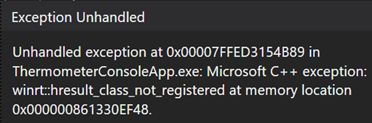
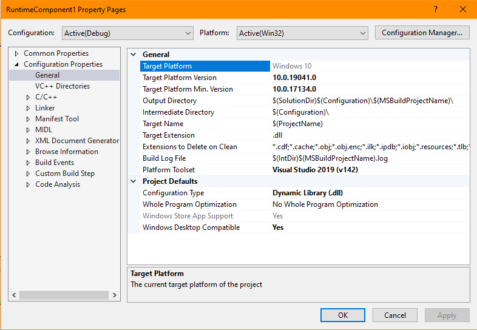

## Sample - Windows Console Application C++/WinRT with Windows Runtime Component (UWP)

##### This sample documents the issues and fixes when adding a Windows Runtime Component (C++/WinRT) to a (C++/WinRT) console app.

Prerequisites:

1. Create a Windows Console Application (C++/WinRT)

2. Create a Windows Runtime Component (C++/WinRT)

3. Add a reference to the Windows Runtime Component

Error:
```
A reference to 'RuntimeComponent1' cannot be added because the two projects target different platforms. 
```

Fix:

Browse to the location of the **winmd** and add it. For example:

```
..\RuntimeComponent1\Debug\Merged\RuntimeComponent1.winmd
```

4.  Add the code to include the class in the Windows Runtime Component. For example:

```
#include "winrt\RuntimeComponent1.h"
using namespace RuntimeComponent1;
. . . 

int main()
{
    init_apartment();
    Uri uri(L"http://aka.ms/cppwinrt");
    auto sm = Class();
    sm.MyProperty(7);
    auto res = sm.MyProperty();
    printf("Hello, %ls. Answer is:%d!\n", uri.AbsoluteUri().c_str(), res);
}
```
Error:



Fix:

a. Set the **Windows Desktop Compatible** flag in the Windows Runtime Component's  project properties (General) to **'Yes'**. This enables the Windows Runtime Component to find the *Windows Store* versions of the VC Runtime Libraries. More information here: [Enhancing Non-packaged Desktop Apps using Windows Runtime Components](https://blogs.windows.com/windowsdeveloper/2019/04/30/enhancing-non-packaged-desktop-apps-using-windows-runtime-components/)



b. Copy the output folder of the Windows Runtime Component to the same output folder for the console app. For example:

```
Copy  ConsoleApp5\Debug\RuntimeComponent1\*.* to ConsoleApp5\Debug
```
You should have the Runtime Component DLL and other files now in the same folder as the console app.

You will now be able to run the console app and call the Windows Runtime Component.


